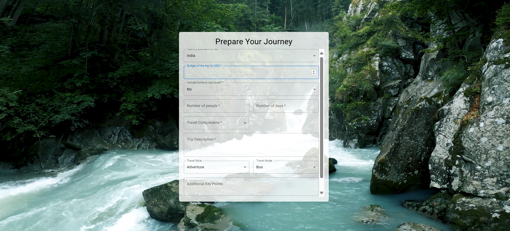
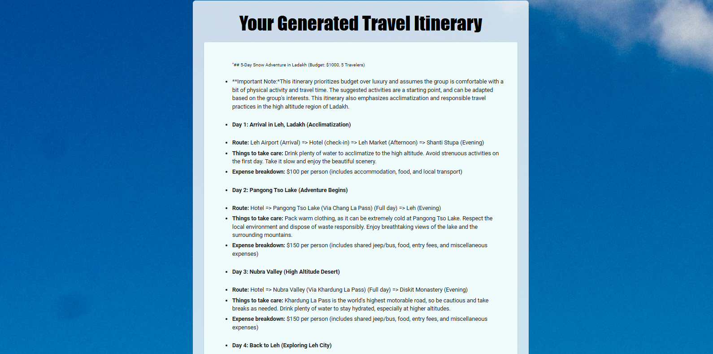

# Wander-Route-Planner

## Overview
This web application generates personalized travel itineraries based on user preferences such as destination, budget, interests, and trip duration. It utilizes AI models to create dynamic, tailored itineraries that are easy to view and customize.

## Screenshots
### Homepage

### Response

## Tech Stack
- **Frontend**: ReactJS (Material UI for styling)
- **Backend**: Flask
- **APIs**: AI21, Gemini, Google APIs

## Key Features
- **AI-Powered Itineraries**: Leverages AI21 and Gemini APIs to generate detailed itineraries based on user input.
- **Responsive UI**: Built with ReactJS and styled using Material UI for an accessible, mobile-friendly experience.
- **Dynamic Inputs**: The form updates based on user choices, providing a personalized and intuitive user experience.
- **Google API Integration**: Provides accurate location data for route suggestions and travel times.

## Future Enhancements
- **User Authentication**: Implementing user authentication for saving itineraries.
- **Database Integration**: Storing user data for personalized trip histories.
- **UI/UX Improvements**: Further enhancements to provide a better user experience.
- **Additional Travel APIs**: Integration with more travel APIs for richer recommendations

### **Future Enhancements**
- **User Authentication**: Implementing user authentication for saving itineraries.
- **Database Integration**: Storing user data for personalized trip histories.
- **UI/UX Improvements**: Further enhancements to provide a better user experience.
- **Additional Travel APIs**: Integration with more travel APIs for richer recommendations.
