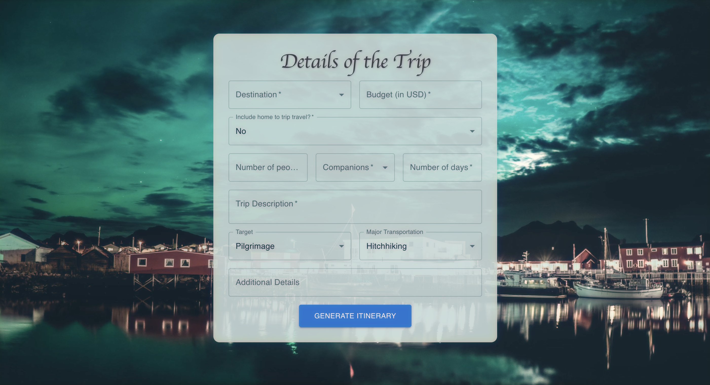
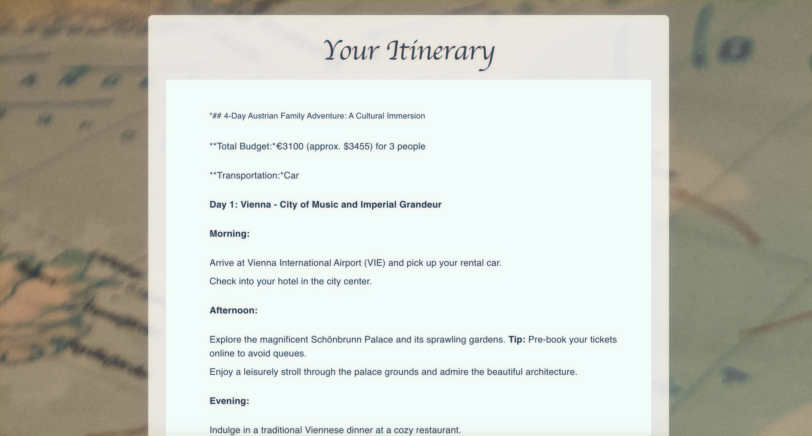

# WanderOut

## Overview
WanderOut is a web application designed to craft personalized travel itineraries tailored to your unique preferences, including destination, budget, interests, and trip duration. By harnessing the power of AI models, it creates dynamic and customizable itineraries that are easy to navigate.

## Screenshots
### Homepage

### Itinerary Response

## Tech Stack
- **Frontend**: Built with ReactJS and styled using Material UI for a sleek look.
- **Backend**: Developed using Flask.
- **APIs**: Integrates AI21, Gemini, and various Google APIs.

## Key Features
- **AI-Powered Itineraries**: Utilizes AI21 and Gemini APIs to produce comprehensive itineraries tailored to your input.
- **Responsive Design**: Designed with ReactJS and Material UI to ensure a user-friendly, mobile-responsive experience.
- **Dynamic Input Forms**: Interactive forms that adapt to your selections, offering a personalized and intuitive interface.
- **Google API Integration**: Accesses precise location data for route suggestions and estimated travel times.

## Future Enhancements
- **User Authentication**: Introducing user authentication to allow saving of itineraries for future reference.
- **Database Integration**: Implementing a database to store user data, enabling personalized trip histories.
- **UI/UX Improvements**: Ongoing enhancements aimed at refining the overall user experience.
- **Expanded API Integration**: Collaborating with additional travel APIs to provide even richer travel recommendations.
